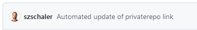

# FAME'24 MDE Hands On Session

This repository has been set up for an exercise used during the [1st International School on Foundations and Advances of Model-Based Engineering](https://fame-school.github.io/). The purpose of the session is to give you basic hands-on experience of some MDE tools and techniques.

## Getting started

You can see this repository, so you have already managed to get through the first step of the activity: to get hold of your own repository. Before you can take the next step, wait and refresh this page until you can see the message below. This indicates that Github has correctly modified this description and that all links provided below have been customised for your personal use.

If this message doesn't appear, the rewrite action has failed to trigger. You can manually trigger it. Speak to Steffen to find out how.

## Exercises

### Step 1: A simple domain-specific modelling language with Xtext

In this step, you will generate and explore a simple domain-specific modelling language (DSML) with a textual concrete syntax. You will use [Xtext](https://www.eclipse.org/Xtext/) to create the DSML. We will only use the most basic features of Xtext, it can do much more. Check out the link to find out more.

> You can [do this activity in your browser](https://ep.mde-network.org/?activities=https://raw.githubusercontent.com/mdenet/fameexercise/main/basic_xtext_activity.json&privaterepo=true). Click on the link and your browser will open the MDENet Education Platform with the activity pre-loaded. You will be asked to sign in to Github; the first time you do this, you will be asked to give the MDENet Application access to your repository. You must do this to complete the activity. The application will only have access to this repository.

After clicking on the link above (open it in a new tab so you can continue to view these instructions), you will see two panels in your browser. The upper panel contains the grammar of the DSML that we will be developing. This grammar consists of rules; each rule describes the concrete syntax of a bit of the language, starting from the top. Have a look over the grammar and see what of it you can understand -- don't worry too much if you cannot understand everything. A good introduction to the Xtext grammar language can be found [here](https://eclipse.dev/Xtext/documentation/102_domainmodelwalkthrough.html).

For now, you will not make changes to this grammar. Instead, click on the little green "run" button in the top right corner and wait for a bit. When you do this, Xtext runs in the background and generates a lot of code from your grammar. This code implements a full IDE for your language!

Once the generation process has finished (a little "Success" popup will appear in the top-right corner of the screen), you will be able to test out the language. For this, click on the link labelled "Try out your language" that has appeared in the left-hand side menu.

This will open a new view (you will be asked again to "sign in with Github"): the left panel is the editor for your new language, the right panel allows us to visualise the internal representation of the language and your model.

First, click on the little diagram button at the top of the *right* panel. This shows a class diagram -- explore it a bit. This is the "meta-model" of your language, sometimes also called the "abstract syntax". It shows the set of classes that Xtext instantiates every time it parses text in your new modelling language. Compare this back to your grammar (you can open a separate copy of the education platform in a separate tab) and see how Xtext has generated a class for every rule and an attribute or reference for every assignment in the grammar. 

Next, look more closely at the left panel. This already contains some text in your new language. Notice the syntax highlighting automatically provided, make some changes, and see how the editor highlights if you are making an error. You can also use `Ctrl+Space` to invoke the auto-completion service. Try this inside an effort statement (indicating who does which work at which percentage of their time) in the place where you have to provide the name of a person. Note how the editor offers you a list of all the names you have previously defined in the model.

Finally, click on the diagram button at the top of the *left* panel. This replaces the contents of the right panel with an object diagram, showing how the classes from the meta-model have been instantiated for your concrete model. Make some changes to the text on the left and regenerate the diagram to explore how the text is translated into a structure of objects. It's these objects that are used whenever we do anything with a model. For example, we will use them in the next step to translate our model into a different model.

> *Extension task.* If you want to explore more beyond the contents of today's session, try going back to the first view and making changes to the grammar. Can you add support for the salary a person gets per hour? If you click on "Save" before opening the generated editor, the education platform will add a commit to your repository with the changes you have made, so that you can work with them the next time you come back to the exercise.

### Step 2: Let's transform our models

In this activity, you will take a model in your DSML and transform it into a different model. In MDE, this is an important activity. It allows us to analyse and enrich models so that they can be used to automate a broad variety of activities in software development. Because we have limited time, we will experiment with a very simple transformation: we will generate a model listing the deliverables implied by a given project plan. We will also generate a list of authors for each deliverable.

> You can [do this activity in your browser](https://ep.mde-network.org/?activities=https://raw.githubusercontent.com/mdenet/fameexercise/main/etl_activity.json&privaterepo=true). Click on the link and your browser will open the MDENet Education Platform with the activity pre-loaded. You will be asked to sign in to Github.

Again, you first see the Xtext grammar. Click the run button to generate the editor and IDE for your language. Open the generated IDE once the generation has completed successfully.

We now have more panels to explore. We still have the editor for our models in the top-left corner. In the top-right corner, we still have the diagram panel that can show us the meta-model for our language or the object-diagram for our current model as before. Below this, we have four panels for building our transformation:

1. The middle left panel is where you will write your transformation code using the [Epsilon Transformation Language (ETL)](https://eclipse.dev/epsilon/doc/etl/). It already contains a basic transformation.
2. In the middle right panel, you will be able to see an object diagram of the model your transformation has produced, if it has been successful.
3. The lower left panel is a console view, which will show output from the running transformation, if any. This will show error messages, but you can also send text there by including print statements in your code. Try adding `"Hello World".println();` just above the line that reads `t.title = s.title;` and run the ETL script to see how this works.
4. In the bottom right corner, you can see the definition of the meta-model of the language in which your output model will be produced. This tells you what classes, attributes, and relationships you need to fill out.

Click on the green run button in the ETL panel and see what happens. Compare the object diagram of your model with the object diagram of the transformation result. Follow the ETL description to understand how this is produced.

Next, try to change the ETL script so that in addition to producing a `Deliverable` object for each `Task`, it fills in the `authors` attribute of the newly created `Deliverable` with a list of the persons working on the task sorted by the percentage of their time they have been working on the task. You can use the `concat(separator : String) : String` operation on the sequence of efforts to turn it into a suitable string.

> *Extension task.* If you want to explore more beyond the contents of today's session, try extending the transformation to compute the cost of each deliverable based on the salary and percentage of the people contributing to it. You will need to first extend the deliverables meta-model with an extra attribute to contain the cost information.
